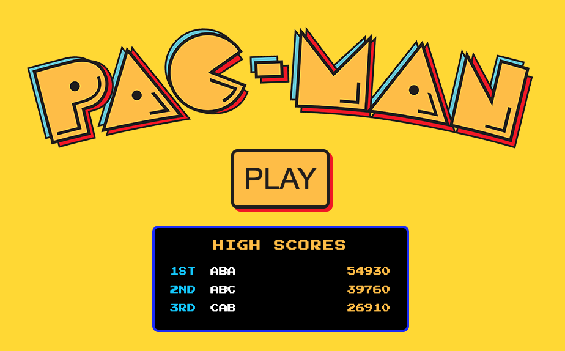
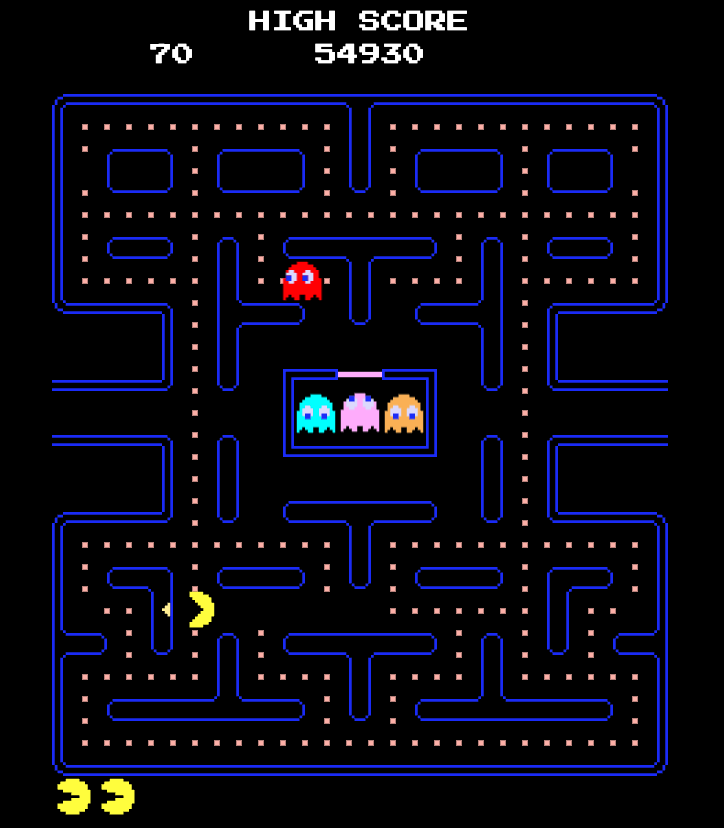

# Pacman

The classic Pacman game, cleaned up and packaged as a **React + Vite** app.

The game engine itself is the original vanilla-JS implementation from
[freepacman.org](https://freepacman.org) — a set of ES classes
(`GameCoordinator`, `Pacman`, `Ghost`, `GameEngine`, `Pickup`,
`CharacterUtil`, `SoundManager`, `Timer`) that drive the DOM directly. It has
been modularized and mounted inside React instead of a static HTML page.

## Getting started

```bash
npm install
npm run dev           # start the dev server (opens http://localhost:5173)
npm run build         # production build to dist/
npm run preview       # serve the production build
npm run reset-scores  # wipe the high-score leaderboard
```

## High scores

The top three scores live in `data/data.json` as plain JSON:

```json
{
  "scores": [{ "name": "RYAN", "score": 4200 }]
}
```

When you lose your last life the engine fires a `gameOver` event. If the score
beats one of the three entries — or a slot is still empty — the arcade name-entry
modal opens and the result is written back to `data/data.json`, pushing the
lowest score off the board. Reads and writes go through a small API
(`/api/scores`) that a Vite plugin mounts on both the dev and preview servers.

Wipe the board at any time with `npm run reset-scores`; you can also edit
`data/data.json` by hand.

## How to play

- Wait for the loading bar to fill — the game starts automatically.
- Steer with the **arrow keys** or **WASD** (or the on-screen D-pad on touch).
- **Esc** pauses, **Q** toggles sound.



## Project layout

```
index.html              Vite entry (loads the Press Start 2P + Material Icons fonts)
data/data.json          Top-three high scores (name + score)
server/
  leaderboard.js        Reads/writes data/data.json, keeps only the top 3
  vite-plugin-leaderboard.js  Mounts the /api/scores endpoints on dev + preview
  reset-scores.js       `npm run reset-scores`
src/
  main.jsx              React root
  App.jsx
  components/Game.jsx   Renders the DOM the engine binds to; boots one GameCoordinator
  game/engine.js        The game engine (original logic), exported as an ES module
  styles/
    layout.css          Container/centering/fonts (replaces the old external CDN CSS)
    game.css            Original game-specific styles (asset paths fixed for /public)
public/
  app/style/graphics/   Sprites, maze, logo, etc.
```

## Notes on the cleanup

The original was a static page wrapped in ads, analytics, tracking, a side-nav
and three external CDN stylesheets. Turning it into a working app involved:

- **Modularizing the engine.** `build/app.js` became `src/game/engine.js`,
  exporting `GameCoordinator`. The runtime `<link>` CSS injection was removed
  in favor of Vite-bundled CSS imports.
- **React mount.** `Game.jsx` renders the exact markup the engine looks up by
  `id` and instantiates the engine once in a `useEffect`.
- **Dropped all third-party cruft** — ads, Google Tag Manager, Plausible,
  Freestar, the side navigation, and the external stylesheets (replaced by a
  small local `layout.css`).
- **Generated two missing sprites** (`pacman_left.svg`, `arrow_left.svg`) by
  horizontally flipping their right-facing counterparts.
- **Audio.** Sound effects and ambience live in `public/app/style/audio/`
  (`.mp3`). Because browsers block audio until the user interacts with the
  page, the AudioContext is unlocked on the first key press / click, so sound
  kicks in from the first input onward.
